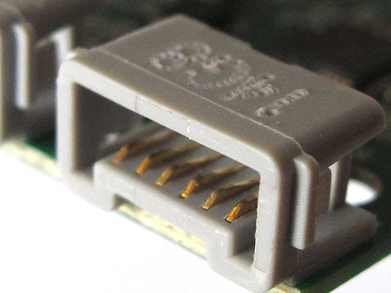

与其在GitHub点星收藏，不如去[阿B](https://space.bilibili.com/242649949)关注我，因为我在B站更活跃一些。

欢迎去视频下方留言讨论、私信交流。毕竟看视频的功能实际展示，比在这里看文字版的文档更直观一些。

如果这些资料有帮助到你，请务必给我的相应视频点赞三连支持一波。

这个项目，以第三方的红外收发模块为例，来着重说明如何：

# 让乐高编程主控 接各类电子模块

### 0. 主控是怎么接乐高官方电机/传感器的

熟悉乐高编程的你，请先回忆一下代码：

```python
from mindstorms import Motor
# 初始化端口 A 上的电机
motor_a = Motor('A')
```

```python
from hub import port
# 初始化端口 A 上的电机
motor_a = port.A.motor
```

以电机为例。上面的两种方式都可以初始化电机对象，之后用同样的方式控制电机，比如：

```python
motor_a.run_to_position(0)
```

这种调用方式，在官方的《MINDSTORMS APP》的Python编程文档中，是作为入门基础资料提供的。尤其是`Motor('A')`这种初始化方式方式，是官方建议使用的。

当我们对`motor_a`对象，调用`run_to_position`方法时，运行在乐高主控上的程序执行环境，会通过主控上A端口向接在主控上的乐高电机，发送控制命令，从而控制电机的运转。

然而，我们并不知道，这期间主控对电机发送了什么具体命令。我们不了解数据的格式、数据的传输速率，更不了解具体的协议。

因为这是乐高的官方私有协议。只有我们使用乐高品牌的主控，再配合乐高官方的外设电机，它们才能完成匹配，正常地交互。

而对于不是乐高品牌的器件来说，用这一套方式就会无从下手。

### 1. 接入非乐高的电子模块，即各种各样的电子模块

必须先要了解乐高主控上的端口和线材的特点，比如线序以及电子特性，我们才能知道接下来如何对各类电子模块接线。

乐高Spike Prime编程主控，共配备了ABCDEF6个端口。这六个端口完全相同，用带有特制水晶头的线材即可插入其中任意一个。





单根线材本身分为6股，并且我们通过ABCDEF的任意一个端口，用眼睛向端口内部观察，也可看到端口内有6个金属簧片触点，这和线材上的这6股是一一对应的。

为方便理解和讨论以及后续的编程，我们对一根线材上的6股线进行编号和命名。1 2 3 4 5 6六股线，分别命名为 `p1 p2 p3 p4 p5 p6`。

从上往下俯视地看，它们的顺序如图：


从功能上来说， `p1 p2`是一组，`p3 p4`是一组，`p5 p6`是一组。因为在Spike Prime的主板上，电路层面已经将这6股线的功能进行了区分。

其中，`p1 p2`用于提供PWM，这主要用于电机控制。而我们对接外设的时候，大部分情况下，其实是可以忽略它们的。


`p3 p4`用于给外设供电：
- p3 接地(GND)
- p4 3.3v (VCC)

唯有`p5 p6`这两股，才是用于数据传输，是我们真正可以编程控制的。

对于市面上很多电子类的外设模块来说，数据交互的协议往往需要2股线就够了。而外设3.3v供电也是主流。

所以基本上，乐高主控的一个Port，比如说端口A，用其中的p3p4p5p6这4股线，大部分情况下就能完成和一个外设的对接。

### 2. 刷固件有什么好处？我必须刷固件吗？

乐高Spike Prime，核心是一颗STM32控制器。有基于STM32开发经验的小伙伴都知道，这颗芯片是有非常强大的能力的。

它支持Micropython编程。在对接外设方面，它有非常多的输入输出引脚。而使用Python进行开发时，直接调用Python的API，就能直接使用封装好的，比如说I2C、UART等等协议，利用这些输入输出引脚和外设之间进行协议对接和数据交互。

获得这样强大且方便功能的前提，是要在STM32上安装好Python执行环境，即刷一个通用的Micropython固件。

根据我--独家轰趴师鄙人粗浅的理解，乐高Spike Prime基于STM32这个通用芯片进行了产品设计，并且它也具备执行Python的能力，那么，它很可能也是使用了Micropython的固件。

并且为了开发乐高可编程主控独有的特性，以及适配自家官方外设的私有协议，乐高一定是在Micropython固件的基础上进行了**魔改**。比如说，它新封装了一些自己私有的东西，以及去掉了Micropython原固件中乐高认为没有必要的东西。

这就导致在很多情况下，开发者并不能完全像使用Micropython一样，使用乐高主控的固件。（不过，有一部分Micropython的特性，也被乐高的魔改固件保留了下来。）

由于乐高Spike Prime是基于STM32的，芯片本身支持Micropython，所以理论上（事实上也是）完全可以给Spike Prime刷回原本的Micropython固件。

如果这样做，我们就可以获得：
- 原生的Micropython的编程体验。(摆脱乐高MINDSTORMS APP等开发环境)
- 几乎全部的STM32基于Micropython的能力。(被乐高阉割掉的那些，通通可以找回来)
- 最优的程序执行性能。(因为我们不知道乐高魔改后，它的常驻进程会吃掉多少运行时资源，我也不知道它分配给用户程序空间多少可用资源)

同时我们会失去：
- 私有协议的支持。我们失去了和乐高品牌外设的交互能力。
- 主控的部分独有特性。比如机载5x5 LED点阵。
- 可靠性。毕竟刷固件还是有一定技术门槛的，对自己动手能力没有自信建议不要碰。

所以说，刷固件的目的，最重要的是就是**找回被乐高阉割掉的**那些本该有的功能。

这都是些什么功能呢？

我认为，**凡是Micropython开发文档中有的，但是乐高的开发文档中没有的**，都属于被乐高阉割掉的功能。理论上都能够通过刷固件找回。

比如，和各类外设对接的功能、各种通讯协议的实现、各种编程API如数学和JSON等等、蓝牙、文件IO、系统和设备控制，等等。

（这里不教各位怎么刷固件，感兴趣的请自行去研究，或找我单独交流）

也就是说，如果刷Micropython固件，我们就可以对ABCDEF这六个端口，每个端口上的`p5p6`进行非常灵活的编程，总计12股线的输入输出控制。

但是，毕竟乐高Spike Prime上运行的这个魔改版，本身还是基于Micropython的。所以其实有些功能，尽管乐高的开发文档没有提及，看似阉割了，但我们仍旧有可能通过种种方式发掘出来：它到底是真的阉割掉了；还是只是藏起来了；或者换了个样貌，包装成了别的方式提供给了我们？

这也正是这期的主旨：我们本着**不刷固件**的原则，就用乐高的官方固件，来尝试发掘出Spike Prime对接外设的功能。

### 3. GPIO

将`p5 p6`用于最常规的输入输出作用。

以端口A为例：

```python
import hub
hub.port.A.mode(hub.port.MODE_GPIO)
wait_for_seconds(1)

p5=hub.port.A.p5
p5.direction(0)
p6=hub.port.A.p6
p6.direction(0)
```
执行这段代码并不需要刷固件。但在执行前，首先需要对外设进行物理上的接线。

我们以PS2键盘为例。了解PS2键盘的小伙伴都知道，PS2那个圆形的接口有6个针脚，但是其中两个是空引脚不起作用。另外4个中，2个用于供电，2个用于数据，就恰好对应着p3p4p5p6。


将线连接后，Spike Prime开机就会直接向PS2键盘供电(某些键盘在3v3电压下也可正常工作)，此时键盘已经处于激活状态，随时准备向Spike Prime主控发送数据。

```python
hub.port.A.mode(hub.port.MODE_GPIO)
wait_for_seconds(1)
```

这是将端口A设为GPIO模式。运行时代码中等待1秒钟是必要的，以确保设置生效。生效后，程序中的`hub.port.A`对象将会更新。如果不等待，执行下面的代码会有可能因为对象未更新而报错。

```python
p5=hub.port.A.p5
p5.direction(0)
p6=hub.port.A.p6
p6.direction(0)
```
获取到`p5 p6`对象，并设置方向。`direction(0)`表示此股线是信号输入，若想用于输出，则设为`direction(1)`

此时，对PS2键盘进行按键操作，就会对`p5 p6`产生信号。可以用`p5.value()`读取信号数据。

一个基本的操作流程就完成了。

但很遗憾的告诉各位，我还没有找到如何在Spike Prime中实现中断触发处理函数，所以对于实时读取一整串PS2键盘发送过来的数据还是蛮困难的。（刷固件可以比较轻松的解决这个问题）

因此，GPIO的方式目前看来更适合于那种单向写的外设，例如屏幕类的外设等等，只需要乐高主控单向向它发送数据即可。此时，需要将数据传输方向设为`direction(1)`，并且主动执行`p5.value(0)`或`p5.value(1)`来写入数据信号。

### 4. UART

启用端口的全双工通信模式，就可以完全兼容支持UART的设备。同样无需刷固件。

```python
ir_sensor = hub.port.A
ir_sensor.mode(hub.port.MODE_FULL_DUPLEX)
sleep_ms(1000) # wait for all duplex methods to appear
ir_sensor.baud(115200)
```
以我此次使用的这一款红外模块为例，该模块本身支持UART通讯。将红外模块和乐高主控之间接好线后，执行这段代码，就完成了乐高侧端口的初始化。

注意，接线时，p5接对方RXD，p6接对方TXD。而只要接线正确，后面的代码中，就不需要再关心具体的p5还是p6了。在全双工模式下，无需对单股线进行操作，只需要以端口为整体进行操作。如：
```python
cmd = bytes(b'\x68\x08\x00\xFF\x10')
ir_sensor.write(cmd)
sleep_ms(1000)
resp = ir_sensor.read(512)
```

端口工作在这种模式下，这个端口的收发数据，是可以通过电脑进行数据调试的：

需要准备一个简单的USB转TTL串口的转换器，USB接入电脑上后注意RXD和TXD对应p5p6的接线。之后在电脑上开启任意串口工具软件调试即可。需要注意，这样调试须保持电脑和乐高Spike Prime主控共地(GND)才能正常识别到数据电平，建议同时使用电脑的另一个USB口插线给Spike Prime保持供电。

一些微型系统，如ESP32或STM32的开发板，也是支持UART的。基于此，就可以用乐高主控实现多个MCU的双向有线数据交互。我个人实践下来，效果非常不错。

### 5. I2C

市面上很多外设是支持I2C协议与MCU之间进行数据通讯的。

Micropython固件是支持在STM32主控上调用硬件I2C端口和SoftI2C的，但遗憾的是，我并没有找到乐高魔改固件中的I2C相关的API。这就意味着，我们必须基于Spike Prime端口的GPIO模式，自己从头手撸实现SoftI2C。

在以前的项目中，我实现了类`SoftI2C`，完成了这个协议的实现并将代码[开源](https://github.com/dujiahongpashi-lego/ZanOS)。

同样不需要刷固件。只要引入`djhps_i2c_hubno6_mpy_firmware.py`的`class DJHPS_SoftI2C`，就可以使用I2C的API了：

```python
from djhps_i2c_hubno6_mpy_firmware import DJHPS_SoftI2C
SDAPIN = p5
SCLPIN = p6
softi2c = DJHPS_SoftI2C(SDAPIN, SCLPIN)
softi2c.writeto(0x3C, 0x80)
```

同样需要特别注意p5p6的定义与接线。

需要注意的是，我只实现了单向的输出，即只有写外设的功能。并没有实现从外设读入数据至乐高主控的API。

### 6. 结尾

至此，原理和代码层面上关于如何用Spike Prime主控对接各类外设，已经说明完毕。

以上的说明，是关于在原理和代码层面上关于如何用Spike Prime主控对接各类外设。包括示例代码，只是在如何调用标准协议API层面进行了说明。

针对具体的外设，应用层的协议请自行实现。(在这个项目中，我使用了一个红外模块，针对这个模块的具体对接协议的实现，包括数据帧格式，都可以在项目开源代码中的`class IR`找到。仅供参考。)

可以看出，使用GPIO模式（包括基于GPIO实现的SoftI2C），在对接外设时还是存在一些局限性。而使用全双工模式（UART），则数据双向传输都是比较完美的。

因此，如果自己动手DIY一些或购买一些可以适配乐高Spike Prime主控的非官方外设，我个人给出如下建议：

- 如果不想伤害乐高原生外设，又想获得上图中这种带有特殊水晶头的适配线材，可在某宝搜索。
- 尽量选择外设的通讯协议是支持UART的。
- 或者，尽量选择外设是单向通讯的，即乐高主控只负责输出。不是说乐高主控没有读GPIO的能力，只是数据变化触发回调处理，代码实现起来比较麻烦(起码我没找到好办法)，并且在开发时需要仔细调试对接协议。
- 调试外设前请仔细了解其通信协议。对于复杂协议的设备，可以考虑使用多个端口。多根线材同时连接到一个外设上。
- 如果你像我一样，有对数据进行有线输入的需求，并且协议并非全双工通信协议。就像我在做[ZanOS](https://github.com/dujiahongpashi-lego/ZanOS)时要对接PS2键盘。那么，欢迎来B站找我讨论刷固件的事情。


# help()极简教程

电脑版普通Python也可使用。
执行python命令，进入Python命令行界面后，输入
```shell
help()
```
控制台会显示一个帮助界面，并进入`help>`命令模式。

我个人不喜欢这个模式，因此输入`quit`退出。

而根据帮助界面的提示，输入
```shell
help('modules')
```
会罗列所有module。

我们的目标是深扒某个模块内部的属性和方法，从而通过这样的方式，通过模块本身来学习这个模块。所以此时我们选定一个模块，例如`sys`，来深入研究它一下。

此时，我们`import sys`，再
```shell
help(sys)
```
则会罗列出sys这个对象中的所有内部对象和方法。

比如看到了一个`path`，对象，于是可以继续`from sys import path`，再
```shell
help(path)
```
又罗列出来了一些内部对象和方法。

所以又可以继续，比如：
```shell
help(path.sort)
```
就这样以此类推，就可以深入了解模块中的细节了。

对于执行Micropython的设备也是同理，help()仍能发挥作用，只不过命令返回的格式可能不如PC版的那么详细而已。唯一的问题是如何进入设备上的python控制台：

### 进入乐高Spike Prime的python控制台，来使用help()
#### 1. 利用MINDSTORMS APP本身
只要写一段代码即可，如：
```python
from mindstorms.control import wait_for_seconds
import hub

help(hub.port)
print('----')
help(hub.port.A)
print('----')
hub.port.A.mode(hub.port.MODE_GPIO)
wait_for_seconds(1)
help(hub.port.A)
print('----')
```
然后在开发环境中执行这段代码就可以了。

唯一的问题就是，它必须每次都依靠代码执行，无法实时动态交互。

#### 2. 串口工具软件
理论上说，PC上任何串口工具软件都可以。因为通过USB线将乐高主控连接到PC后，它就与PC建立了串口连接。通过串口工具发送数据命令，就会在主控的python控制台上执行。

我用的是[Thonny](https://thonny.org/)工具软件（中文版），具体操作是：
- 菜单栏-运行-配置解释器
- 解释器-Micropython通用，端口-COM几需要选择乐高主控对应端口
- 工具栏-STOP(停止/重启后端进程)

然后在shell标签页下，就可以使用乐高主控上的python控制台命令行了。

# 项目目录说明

- android：支持发射红外信号的安卓APP的源码。使用Kotlin开发。
- blueprints：图纸。含BINGOBRICKS原版乒乓球训练机部分电子版资料；本人自己逆向还原的抛球机图纸io文件等等。io文件请使用studio2.0软件打开。
- hub：


